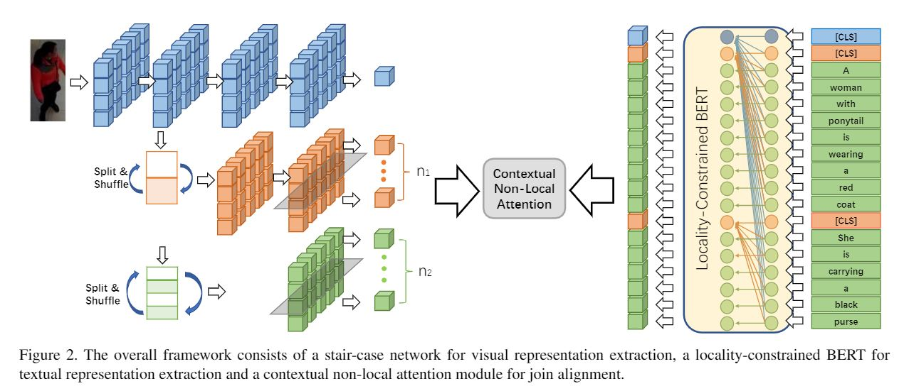

# Contextual Non-Local Alignment over Full-Scale Representation for Text-Based Person Search

Text-based person search aims at retrieving target person in an image gallery using a descriptive sentence of that person. It is very challenging since modality gap makes effectively extracting discriminative features more difficult. Moreover, the inter-class variance of both pedestrian images and descriptions is small. Hence, comprehensive information is needed to align visual and textual clues across all scales. Most existing methods merely consider the local alignment between images and texts within a single scale (e.g. only global scale or only partial scale) or simply construct alignment at each scale separately. To address this problem, we propose a method that is able to adaptively align image and textual features across
all scales, called NAFS (i.e. Non-local Alignment over Full-Scale representations). Firstly, a novel staircase network structure is proposed to extract full-scale image features with better locality. Secondly, a BERT with locality constrained attention is proposed to obtain representations of descriptions at different scales. Then, instead of separately aligning features at each scale, a novel contextual non-local attention mechanism is applied to simultaneously discover latent alignments across all scales. The experimental results show that our method outperforms the state-of-the-art methods by 5.53% in terms of top-1 and 5.35% in terms of top-5 on text-based person search dataset

## Model Framework



## Requirement
* Python 3.7
* Pytorch 1.0.0 & torchvision 0.2.1
* numpy
* matplotlib (not necessary unless the need for the result figure)  
* scipy 1.2.1 
* pytorch_transformers

## Usage

### Data Preparation

1. Please download [CUHK-PEDES dataset](https://github.com/ShuangLI59/Person-Search-with-Natural-Language-Description) .
3. Download [pretrained Resnet50 model](https://download.pytorch.org/models/resnet50-19c8e357.pth),  [bert-base-uncased model](https://s3.amazonaws.com/models.huggingface.co/bert/bert-base-uncased.tar.gz) and [vocabulary](https://s3.amazonaws.com/models.huggingface.co/bert/bert-base-uncased-vocab.txt)
3. Set the config in `/example/NAFS/Nafs.yaml`

### Training & Testing

Set the config in `config.yaml`,  like
```
gpus: [0,1,2,3]
yaml: ../example/NAFS/Nafs.yaml
```
change the image_model_path and language_model_path config in `example/NAFS/Nafs.yaml`
```
export PYTHONPATH=root_path
cd root_path/train; python3 Nafs_Trainer.py
```

## Model Performance
<p align="center"></p>
<p align="center"></p>

## Citation
```
@article{gao2021contextual,
  title={Contextual Non-Local Alignment over Full-Scale Representation for Text-Based Person Search},
  author={Gao, Chenyang and Cai, Guanyu and Jiang, Xinyang and Zheng, Feng and Zhang, Jun and Gong, Yifei and Peng, Pai and Guo, Xiaowei and Sun, Xing},
  journal={arXiv preprint arXiv:2101.03036},
  year={2021}
}
```
